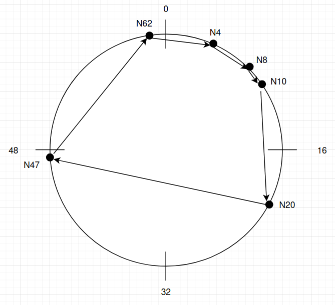

# Notas - Aulas Práticas


#
- Nós -> mapeado em IDs (de 0 a 2^n - 1)
- Keys -> mapeado em IDs (de 0 a 2^n - 1)
- m -> número de bits do ID

#
- m = 6
- IDs: 0 .. 63

## Nodes
Cada nó conhece o seu sucessor e precessor (em versões mais avançadas até conhece outras coisas)

## IDs
### sucID - sucessor ID (ID sucessor)
Podemos calcular sucessor de ID
O sucessor de um ID é sempre o primeiro nó que encontramos quando percorremos o "relógio"

Exemplos:
- sucID(4) = 4
- sucID(5) = 8
- sucID(16) = 20
- sucID(28) = 28
- sucID(48) = 62
- sucID(63) = 4

Um par (key, value) com key=4 é armazenado no nó 4.
Um par (key, value), com key=5 é armazenado no nó 8.

(Ou seja, se de repente for criado um nó 6, por exemplo, vamos ter de criar aí uma artimanha pois (key,value), com key=5 passa a ser armazenado no nó 6, e não no nó 8).

## paper-ton.pdf
https://pdos.csail.mit.edu/papers/ton:chord/paper-ton.pdf

### node.find.successor(id) (Do artigo)

```
# id pertence ] n, successor ]  
if n < id and id <= successor:  
    return successor  
else:  
    # Isto é um RPC (não é efetuado localmente e sim   remotamente - NÃO PODEMOS FAZER)  
    return successor.find.sucessor(id)  
```

### Alternativa:

```
if n < id and id <= successor:  
    return successor
else:  
    # mandar mensagem ao successor  
    # algo tipo successor.send(FIND_SUCCESSOR_MSG)  
```

#
## Finger Table
Quando um nó recebe uma mensagem que não é da sua responsabilidade, passa-a ao seu sucessor, que, por sua vez, caso a mensagem também não seja da sua responsabilidade faz o mesmo processo.

Isto funciona para poucos nós, no entanto, se tivermos, por exemplo, 1000 nós, possivelmente uma mensagem poderá efetuar 999 saltos o que não é muito eficiente.


Uma solução seria criar um método tipo pesquisa binária (bastante eficiente) que dependendo da distância presumida a que nos encontramos vamos mandar a mensagem para o nó que está presumivelmente mais próximo do nosso destino.

Com isto surgiram as Finger Tables.
Nesta nova implementação, quando a key não pertence a n < key <= successor, o nó vai à sua finger table e vê qual é o maior sucessor que não excede o valor da key recebida e envia para esse nó.

### Exemplo:


#
- Nós -> mapeado em IDs (de 0 a 2<sup>n-1</sup>)
- Keys -> mapeado em IDs (de 0 a 2<sup>n-1</sup>)
- m -> número de bits do ID

#
- m = 6
- IDs: 0 .. 63

#

Se o nó 4 receber uma mensagem com key = 50, vai à sua finger table que é da seguinte forma:


<table>
    <tr>
        <th colspan="3" style="text-align: center">Finger Table (N=4)</th>
    </tr>
    <tr>
        <td>1</td>
        <td>sucID(5) = <b>8</b></td>
        <td><b>addr(N8)</b></td>
    </tr>
    <tr>
        <td>2</td>
        <td>sucID(6) = <b>8</b></td>
        <td><b>addr(N8)</b></td>
    </tr>
    <tr>
        <td>3</td>
        <td>sucID(8) = <b>8</b></td>
        <td><b>addr(N8)</b></td>
    </tr>
        <td>4</td>
        <td>sucID(12) = <b>20</b></td>
        <td><b>addr(N20)</b></td>
    </tr>
        <td>5</td>
        <td>sucID(20) = <b>20</b></td>
        <td><b>addr(N20)</b></td>
    </tr>
        <td>6</td>
        <td>sucID(36) = <b>47</b></td>
        <td><b>addr(N47)</b></td>
    </tr>
    <tr>
        <td style="text-align: center"><b>i</b></td>
        <td style="text-align: center"><b>id</b></td>
        <td style="text-align: center"><b>addr</b></td>
    </tr>
</table>

O <b>id</b> principal é o nó que recebeu a mensagem, no caso o nó 4.  
Os id's da tabela são calculados da seguinte forma:  
- <b>id = sucID( (id + 2<sup>i-1</sup>) % 2<sup>m</sup> )</b>
#

Para i=1, temos:  

id = sucID( (4 + 2<sup>1-1</sup>) % 2<sup>6</sup> ) =  
   = sucID( (4 + 2<sup>0</sup>) % 64 ) =  
   = sucID( (4 + 1) % 64 ) =  
   = sucID( 5 % 64 ) =  
   = sucID(5) =  
   = <b>8</b>

## Refresh
O método refresh retorna uma lista de tuplos em que cada tuplo tem o formato:  

- (id, (id + 2<sup>i-1</sup>)%2<sup>m</sup>, finger_addr[i])  


Ou seja retorna:  
[ ( - , - , - ), ( - , - , - ), ( - , - , - ), ( - , - , - ), ( etc ... ) ]

## Notas Extra

Se no closest_preceding_node dermos return de n como no <a href="https://pdos.csail.mit.edu/papers/ton:chord/paper-ton.pdf">artigo</a> há um teste que não vamos passar - disse o Lau